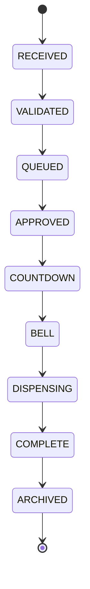

# Alpacaly Event Engine Server

This directory contains the Phase 7B-1 backend for Alpacaly Ever After. It is a Node.js 24 and Express service in which verified Contributions create durable FeedIntents before feed requests can enter the Event Engine. It persists provider-neutral contribution records, FeedIntent work, lifecycle state, device commands, administrator identities, scoped permissions, immutable operator audit records, acknowledgements, and recovery history in SQLite. The Event Engine applies welfare rules, runs resource-isolated feeder queues, and requests durable simulated device actions through a hardware-neutral adapter boundary.

## Phase 7B-1 boundaries

Included:

- Express HTTP server
- Health endpoint
- Feed-request API
- Browser API client integration with configurable CORS
- SQLite Event Store and restart-safe FIFO queue
- Explicit Barn, Feeder, Camera, Device, and resource Queue identities
- Stable default Barn, Feeder, and Queue assignments for the existing website
- Versioned, in-place SQLite schema migrations
- Independent FIFO processing for every configured feeder
- One simultaneous active lifecycle per feeder
- Feeder queue statistics and resource-aware API routes
- Provider-neutral ProviderEvent ingestion and Contribution verification boundaries
- Provider-scoped idempotency using `provider` and `externalEventId`
- Immutable ProviderEvent, Contribution, and Event links
- Structured persistent contribution audit records
- One immutable FeedIntent and one durable Outbox entry per eligible Contribution
- Automatic Outbox reconciliation, retry, clean shutdown, and restart recovery
- Database-enforced one-to-one FeedIntent-to-Event processing
- Durable `RING_BELL` and `DISPENSE_FEED` DeviceCommands with one command per Event action
- Persistent Device Command Outbox, state history, acknowledgements, and audit records
- Hardware-neutral `DeviceAdapter` boundary with a simulated adapter only
- Acknowledgement-gated `BELL` and `DISPENSING` lifecycle advancement
- Per-feeder command ordering, idempotent command IDs, monotonic fencing tokens, retry, timeout, and unknown-outcome handling
- Restart-safe simulated device execution memory that prevents duplicate physical simulation
- Development-only simulated WEBSITE Contribution flow
- Immutable, server-generated Event IDs
- Timestamped lifecycle timeline for every accepted request
- Strict lifecycle transitions from `RECEIVED` through `ARCHIVED`
- Automatic database reconnection, state restoration, and lifecycle resumption
- Live browser updates over Server-Sent Events
- Server-calculated queue positions and estimated wait times
- Supporter display of the live Event ID, lifecycle state, queue position, and wait estimate
- Admin display of the live queue, active event, archive, and server connection status
- Provider-neutral `AuthProvider` boundary for a future managed OpenID Connect provider
- Development-only, server-controlled administrator identities
- Persisted Administrators, RoleAssignments, BarnScopes, and append-only OperatorAuditRecords
- `VIEWER`, `WELFARE_OPERATOR`, `HARDWARE_OPERATOR`, and `ADMINISTRATOR` permissions
- Barn-scoped authorization with explicit platform-wide assignments
- Protected administrator, queue-history, device-command, welfare, and reset APIs
- Durable feeder pause/unavailable/maintenance and device pause/maintenance state
- Public API presenters that omit supporter identity, Contribution data, lifecycle internals, and hardware details
- REST polling fallback and automatic recovery after temporary server outages
- Future-facing bell and dispensing acknowledgement records
- Restart-safe duplicate protection across ProviderEvents, Contributions, FeedIntents, Outbox entries, and Events
- Configurable daily feed limit and feeding window
- Structured JSON application and HTTP request logs
- Automated unit and API tests
- Automated SQLite schema and restart-recovery tests

Intentionally excluded:

- Stripe or any real payment processing
- YouTube, TikTok, Facebook, or other provider integrations
- Real managed OpenID Connect provider integration, passwords, and production sessions
- Dual approval, emergency stop, and manual `OUTCOME_UNKNOWN` resolution
- Real hardware transports, feeder control, MQTT, GPIO, Raspberry Pi, or ESP32 integration
- Camera integration or streaming
- Live-video integration

SQLite is the durable source of truth. ProviderEvent ingestion, Contribution verification, FeedIntent authorisation, Feed Request creation, lifecycle coordination, Device Command creation, delivery, and acknowledgement handling are separate responsibilities. A crash can leave only durable pending work or a fully committed result. Workers reconcile unfinished FeedIntent and Device Command work on startup. Database uniqueness prevents repeated work from creating another Event or another command for the same Event action. Persistent simulated device execution memory and fencing prevent a replay from performing a command twice or allowing an older command to overtake a newer device token. The Event Engine still maintains one isolated runtime per feeder, while the original website and read APIs remain scoped to the default feeder.

## Requirements

- Node.js 24 LTS
- npm 11 or later

## Local setup

```sh
cd server
cp .env.example .env
npm install
npm run dev
```

The default server address is `http://localhost:3000`.

## Configuration

| Variable | Default | Purpose |
| --- | --- | --- |
| `NODE_ENV` | `development` | Runtime environment label used in logs and health output. |
| `PORT` | `3000` | HTTP listening port. |
| `LOG_LEVEL` | `info` | Pino structured-log level. |
| `MAX_DAILY_FEEDS` | `100` | Maximum feed requests accepted per feeder in one local calendar day. |
| `ENFORCE_FEEDING_WINDOW` | `false` | Reject requests outside the configured welfare window when `true`. |
| `FEEDING_WINDOW_START` | `08:00` | Local start time in 24-hour format. |
| `FEEDING_WINDOW_END` | `18:00` | Local end time in 24-hour format. |
| `REQUEST_BODY_LIMIT` | `16kb` | Maximum JSON request-body size accepted by Express. |
| `CORS_ORIGIN` | `*` | Browser origin allowed to call the API. Restrict this before production. |
| `DATABASE_PATH` | `./data/alpacaly.sqlite` | SQLite Event Store path, resolved from the server working directory. |
| `ENABLE_DEMO_RESET` | development only | Enables the Reset Demo button and reset endpoint outside production. |
| `ENABLE_DEVELOPMENT_CONTRIBUTION_SIMULATION` | development only | Enables simulated WEBSITE Contributions and legacy write adapters. Always disabled when `NODE_ENV=production`. |
| `ENABLE_DEVELOPMENT_AUTHENTICATION` | `false` | Explicitly enables server-controlled local administrator identities in development or test. It is always rejected in production. The example development environment enables it. |
| `OUTBOX_POLL_INTERVAL_MS` | `250` | Delay between background checks for durable FeedIntent work. |
| `OUTBOX_RETRY_DELAY_MS` | `1000` | Delay before retrying a failed Outbox processing attempt. |
| `DEVICE_COMMAND_POLL_INTERVAL_MS` | `100` | Delay between durable Device Command reconciliation passes. |
| `DEVICE_COMMAND_RETRY_DELAY_MS` | `1000` | Delay before retrying a command confirmed not to have run. |
| `DEVICE_COMMAND_MAXIMUM_ATTEMPTS` | `3` | Maximum safe delivery attempts before a command fails. |
| `DEVICE_ACKNOWLEDGEMENT_TIMEOUT_MS` | `5000` | Deadline for a device acknowledgement before reconciliation. |
| `LIFECYCLE_COUNTDOWN_MS` | `10000` | Simulated countdown duration before the bell stage. |
| `LIFECYCLE_BELL_MS` | `3000` | Simulated bell-stage duration. No bell hardware is controlled. |
| `LIFECYCLE_DISPENSING_MS` | `2000` | Simulated dispensing-stage duration. No feeder hardware is controlled. |
| `LIFECYCLE_ARCHIVE_DELAY_MS` | `2000` | Delay between completion and persistent archival. |

## Persistent Event Store

The persistent Event Store introduced in Phase 4 uses the `node:sqlite` module included with Node.js 24, so no additional database package or native addon is required. File-backed databases use foreign keys, write-ahead logging, full synchronous durability, and a five-second busy timeout.

The schema is upgraded automatically through ordered migrations when the server connects. Migration 2 adds the resource model. Migration 3 adds the Contribution Ledger. Migration 4 adds FeedIntents, the durable Outbox, and FeedIntent history. Migration 5 adds feeder-to-device assignments, durable DeviceCommands, their Outbox, acknowledgements, state history, audit records, and simulated device execution/fence memory. Migration 6 adds administrator identities, role assignments, Barn scopes, immutable operator audits, welfare notes, and durable feeder/device operational state. Existing Events, histories, commands, acknowledgements, queues, and contribution audit data are preserved. Commands are created only when Events enter or resume `BELL` and `DISPENSING`. The principal relationships are:

```sql
CREATE TABLE Events (
    eventId TEXT PRIMARY KEY,
    type TEXT NOT NULL,
    sequenceNumber INTEGER NOT NULL UNIQUE,
    supporterName TEXT NOT NULL,
    source TEXT NOT NULL,
    message TEXT NOT NULL DEFAULT '',
    clientRequestId TEXT UNIQUE,
    requestedAt TEXT NOT NULL,
    updatedAt TEXT NOT NULL,
    currentState TEXT NOT NULL,
    barnId TEXT,
    feederId TEXT,
    queueId TEXT,
    contributionId TEXT,
    feedIntentId TEXT,
    FOREIGN KEY (barnId) REFERENCES Barns(barnId),
    FOREIGN KEY (feederId) REFERENCES Feeders(feederId),
    FOREIGN KEY (queueId) REFERENCES Queues(queueId),
    FOREIGN KEY (contributionId) REFERENCES Contributions(contributionId),
    FOREIGN KEY (feedIntentId) REFERENCES FeedIntents(feedIntentId)
) STRICT;

CREATE TABLE ProviderEvents (
    providerEventId TEXT PRIMARY KEY,
    provider TEXT NOT NULL,
    externalEventId TEXT NOT NULL,
    receivedAt TEXT NOT NULL,
    verificationStatus TEXT NOT NULL,
    rawMetadataJson TEXT NOT NULL DEFAULT 'null',
    rejectionReason TEXT,
    createdAt TEXT NOT NULL,
    updatedAt TEXT NOT NULL,
    UNIQUE (provider, externalEventId)
) STRICT;

CREATE TABLE Contributions (
    contributionId TEXT PRIMARY KEY,
    providerEventId TEXT NOT NULL UNIQUE,
    verifiedAt TEXT NOT NULL,
    amountMinor INTEGER NOT NULL,
    currency TEXT NOT NULL,
    supporterDisplayName TEXT NOT NULL,
    eligibilityStatus TEXT NOT NULL,
    feedQuantity INTEGER NOT NULL,
    metadataJson TEXT NOT NULL DEFAULT 'null',
    createdAt TEXT NOT NULL,
    updatedAt TEXT NOT NULL,
    FOREIGN KEY (providerEventId) REFERENCES ProviderEvents(providerEventId)
) STRICT;

CREATE TABLE AuditRecords (
    auditSequence INTEGER PRIMARY KEY AUTOINCREMENT,
    auditRecordId TEXT NOT NULL UNIQUE,
    action TEXT NOT NULL,
    providerEventId TEXT,
    contributionId TEXT,
    eventId TEXT,
    occurredAt TEXT NOT NULL,
    detailsJson TEXT NOT NULL DEFAULT 'null'
) STRICT;

CREATE TABLE FeedIntents (
    feedIntentId TEXT PRIMARY KEY,
    contributionId TEXT NOT NULL UNIQUE,
    barnId TEXT NOT NULL,
    feederId TEXT NOT NULL,
    queueId TEXT NOT NULL,
    message TEXT NOT NULL DEFAULT '',
    status TEXT NOT NULL,
    createdAt TEXT NOT NULL,
    outboxQueuedAt TEXT NOT NULL,
    processingStartedAt TEXT,
    feedRequestCreatedAt TEXT,
    queueInsertionCompletedAt TEXT,
    processingCompletedAt TEXT,
    processingFailedAt TEXT,
    failureReason TEXT,
    attemptCount INTEGER NOT NULL,
    updatedAt TEXT NOT NULL,
    FOREIGN KEY (contributionId) REFERENCES Contributions(contributionId)
) STRICT;

CREATE TABLE Outbox (
    outboxSequence INTEGER PRIMARY KEY AUTOINCREMENT,
    outboxEntryId TEXT NOT NULL UNIQUE,
    feedIntentId TEXT NOT NULL UNIQUE,
    status TEXT NOT NULL,
    createdAt TEXT NOT NULL,
    availableAt TEXT NOT NULL,
    processingStartedAt TEXT,
    completedAt TEXT,
    failedAt TEXT,
    attemptCount INTEGER NOT NULL,
    lastError TEXT,
    updatedAt TEXT NOT NULL,
    FOREIGN KEY (feedIntentId) REFERENCES FeedIntents(feedIntentId)
) STRICT;

CREATE TABLE FeedIntentHistory (
    historySequence INTEGER PRIMARY KEY AUTOINCREMENT,
    feedIntentId TEXT NOT NULL,
    action TEXT NOT NULL,
    timestamp TEXT NOT NULL,
    detailsJson TEXT NOT NULL DEFAULT 'null',
    FOREIGN KEY (feedIntentId) REFERENCES FeedIntents(feedIntentId)
) STRICT;

CREATE TABLE Barns (
    barnId TEXT PRIMARY KEY,
    name TEXT NOT NULL,
    timezone TEXT NOT NULL,
    createdAt TEXT NOT NULL
) STRICT;

CREATE TABLE Feeders (
    feederId TEXT PRIMARY KEY,
    barnId TEXT NOT NULL,
    name TEXT NOT NULL,
    createdAt TEXT NOT NULL,
    FOREIGN KEY (barnId) REFERENCES Barns(barnId)
) STRICT;

CREATE TABLE Cameras (
    cameraId TEXT PRIMARY KEY,
    barnId TEXT NOT NULL,
    name TEXT NOT NULL,
    createdAt TEXT NOT NULL,
    FOREIGN KEY (barnId) REFERENCES Barns(barnId)
) STRICT;

CREATE TABLE Devices (
    deviceId TEXT PRIMARY KEY,
    barnId TEXT NOT NULL,
    name TEXT NOT NULL,
    kind TEXT NOT NULL,
    createdAt TEXT NOT NULL,
    FOREIGN KEY (barnId) REFERENCES Barns(barnId)
) STRICT;

CREATE TABLE Queues (
    queueId TEXT PRIMARY KEY,
    barnId TEXT NOT NULL,
    feederId TEXT NOT NULL UNIQUE,
    resourceType TEXT NOT NULL,
    resourceId TEXT NOT NULL,
    name TEXT NOT NULL,
    createdAt TEXT NOT NULL,
    FOREIGN KEY (barnId) REFERENCES Barns(barnId),
    FOREIGN KEY (feederId, barnId) REFERENCES Feeders(feederId, barnId)
) STRICT;

CREATE TABLE LifecycleHistory (
    historyId INTEGER PRIMARY KEY AUTOINCREMENT,
    eventId TEXT NOT NULL,
    ordinal INTEGER NOT NULL,
    state TEXT NOT NULL,
    timestamp TEXT NOT NULL,
    detailsJson TEXT NOT NULL DEFAULT 'null',
    FOREIGN KEY (eventId) REFERENCES Events(eventId) ON DELETE CASCADE,
    UNIQUE (eventId, ordinal),
    UNIQUE (eventId, state)
) STRICT;

CREATE TABLE Queue (
    eventId TEXT PRIMARY KEY,
    queueId TEXT NOT NULL,
    queuePosition INTEGER NOT NULL,
    enqueuedAt TEXT NOT NULL,
    FOREIGN KEY (eventId) REFERENCES Events(eventId) ON DELETE CASCADE,
    FOREIGN KEY (queueId) REFERENCES Queues(queueId),
    UNIQUE (queueId, queuePosition)
) STRICT;

CREATE TABLE HardwareAcknowledgements (
    acknowledgementId INTEGER PRIMARY KEY AUTOINCREMENT,
    eventId TEXT NOT NULL,
    stage TEXT NOT NULL,
    status TEXT NOT NULL,
    receivedAt TEXT NOT NULL,
    detailsJson TEXT NOT NULL DEFAULT 'null',
    FOREIGN KEY (eventId) REFERENCES Events(eventId) ON DELETE CASCADE
) STRICT;
```

`Queues` describes operational queues, while `Queue` contains their event membership. Database constraints and triggers enforce Barn–Feeder–Queue consistency, one Contribution per ProviderEvent, one FeedIntent per Contribution, one Outbox entry and Event per FeedIntent, verified eligibility before FeedIntent processing, integer minor currency amounts, and immutable identities. An Event insert is rejected unless its matching FeedIntent and Outbox entry are both claimed for processing.

Verifying an eligible Contribution is one transaction containing the Contribution, FeedIntent, Outbox entry, and initial intent history. Processing it is one transaction containing the Event, its Contribution and FeedIntent references, `RECEIVED`, `VALIDATED`, and `QUEUED` history entries, FIFO queue record, `FEED_REQUEST_CREATED` audit record, and completed Outbox state. Each later lifecycle transition is another guarded transaction.

On restart, an Event already in `COUNTDOWN`, `BELL`, `DISPENSING`, or `COMPLETE` resumes at that state. Countdown and archive timing use persisted timestamps. `BELL` and `DISPENSING` reconcile or resume their durable DeviceCommands and advance only after a successful acknowledgement.

The durable creation pipeline is:

```text
ProviderEvent -> Contribution -> FeedIntent -> Outbox -> Feed Request -> Queue
Queue -> BELL -> RING_BELL command -> acknowledgement
      -> DISPENSING -> DISPENSE_FEED command -> acknowledgement -> COMPLETE
```

The Outbox worker starts with the application, repairs any verified eligible Contribution missing durable work, resets interrupted `PROCESSING` entries to `PENDING`, and processes them in Outbox sequence order. It stops accepting background work before the Event Engine closes during server shutdown.

## Feed lifecycle

Every accepted request receives one immutable Event ID and advances through the following states in order:



Every transition adds a timestamped timeline entry and a state-specific timestamp. Only the head of the FIFO queue can be processed. Processing and transition guards prevent the same Event ID from being advanced twice.

Entering `BELL` creates exactly one `RING_BELL` command. Entering `DISPENSING` creates exactly one `DISPENSE_FEED` command. Commands pass through `PENDING`, `READY`, `SENT`, and `ACKNOWLEDGED`, with `RETRY_SCHEDULED`, `TIMED_OUT`, `FAILED`, `OUTCOME_UNKNOWN`, and `CANCELLED` available for non-happy paths. The simulated adapter emits durable acknowledgements; no real device is connected or controlled.

## API

### Health

```http
GET /health
```

Returns HTTP 200 with the service name, environment, timestamp, and process uptime.

### Simulate a website Contribution

```http
POST /api/development/website-contributions
Content-Type: application/json

{
  "supporterName": "Ada",
  "message": "For the herd",
  "clientRequestId": "website-unique-request-123",
  "amountMinor": 500,
  "currency": "GBP"
}
```

This development-only endpoint creates a `WEBSITE` ProviderEvent, applies server-controlled simulated verification, atomically persists its Contribution, FeedIntent, and Outbox entry, and synchronously asks the worker to process the durable work. `amountMinor` is always stored as an integer. Supplying the same `clientRequestId` again returns the original Event rather than creating duplicates. The public response contains only the supporter-safe Event status; ProviderEvent, Contribution, raw metadata, supporter identity, and hardware details remain server-side. The endpoint rejects client-supplied provider, verification, eligibility, contribution, or feed-quantity decisions and is unconditionally disabled in production.

### Legacy development write adapter

```http
POST /api/feed-requests
Content-Type: application/json

{
  "supporterName": "Ada",
  "source": "website",
  "message": "For the herd",
  "clientRequestId": "website-unique-request-123"
}
```

This route remains temporarily for compatibility, but no longer creates an Event directly. In development it delegates to the same simulated WEBSITE Contribution service. It is disabled in production and should not be used by new clients.

### Read the waiting queue

```http
GET /api/feed-requests
```

Returns supporter-safe summaries for the active persistent FIFO queue and archive. Each summary includes its Event ID, current state, queue position, and estimated wait time. Supporter names, messages, client request IDs, Contribution links, complete timelines, and hardware acknowledgement details are omitted.

### Read one feed request

```http
GET /api/feed-requests/:feedRequestId
```

Returns the current supporter-safe state, queue position, and estimated wait time of an accepted request, or HTTP 404 for an unknown ID. Complete timelines and private supporter information are available only through a scoped administrator API. Server restarts do not invalidate Event IDs.

### Legacy feeder development write adapter

```http
POST /api/feeders/:feederId/feed-requests
Content-Type: application/json
```

In development this creates a simulated WEBSITE Contribution and routes its resulting feed request to `feederId`. It is disabled in production. Provider idempotency remains global to the ledger and feeder selection cannot bypass a duplicate provider event.

### Read a feeder queue

```http
GET /api/feeders/:feederId/queue
GET /api/feeders/:feederId/feed-requests
```

Both forms return supporter-safe entries for that feeder's isolated waiting/active queue, archive, and statistics. Statistics include waiting count, active count, archived count, estimated wait, feeder status, and safe active Event status.

### Read one feeder event

```http
GET /api/feeders/:feederId/feed-requests/:feedRequestId
```

Returns the event only when it belongs to the requested feeder.

### Monitor all feeder queues

```http
GET /api/feeders
GET /api/event-engine/queues
```

Returns the statistics for every configured feeder without combining queue contents or ordering.

### Event Engine status

```http
GET /api/event-engine/status
```

Returns the default feeder's queue totals, current lifecycle state, active event summary, accepted/completed counts, archive total, remaining daily allowance, and whether the feeding window is enforced.

### Live lifecycle events

```http
GET /api/event-engine/events
Accept: text/event-stream
```

Opens a Server-Sent Events stream. The server sends a named `lifecycle` event immediately and after every state change. Each event contains the latest Event Engine snapshot; state-change events also identify the Event ID, new state, transition timestamp, and supporter-safe request summary. The admin dashboard uses this stream for real-time state display and keeps REST polling as a fallback.

### Reset the development queue

```http
POST /api/event-engine/reset
Content-Type: application/json
Authorization: Development local-admin

{"reason":"Local development reset"}
```

Clears Event, ledger, Outbox, command, and simulated-device state so the existing Reset Demo button remains functional during local development. Administrator identities and immutable operator audit records are retained. The endpoint requires a platform-wide `ADMINISTRATOR`, records the attempt and result, and is disabled when `ENABLE_DEMO_RESET=false`. Development authentication and reset are unavailable in production.

### Administrator authentication

Every `/api/admin` route requires an authenticated, active Administrator. Phase 7B-1 does not store passwords and does not connect a real identity provider. When `ENABLE_DEVELOPMENT_AUTHENTICATION=true` outside production, local clients may use one of the fixed server-controlled development credentials:

```http
Authorization: Development local-admin
```

The predefined local identities are `local-admin`, `local-viewer`, `local-welfare`, and `local-hardware`. A caller cannot supply roles or Barn scopes; the server maps each credential to persisted assignments. Production rejects this adapter even if the environment variable is set. The authentication service returns an internal trusted identity containing the mapped Administrator ID, external identity ID, active roles and Barn scopes, authentication time and strength, and a session identifier. Session identifiers and credentials are never returned in audit records.

| Role | Barn-scoped capabilities |
| --- | --- |
| `VIEWER` | Barn/feeder status, queues, command history, and scoped audit history |
| `WELFARE_OPERATOR` | Viewer capabilities plus feeding pause, welfare unavailability, welfare notes, and uncertain-outcome review requests |
| `HARDWARE_OPERATOR` | Viewer capabilities plus device pause/maintenance, command failure inspection, policy-permitted retry requests, and hardware-alert acknowledgement |
| `ADMINISTRATOR` | All capabilities plus platform-wide identity, role, Barn-scope, and security-configuration management when explicitly assigned platform-wide |

Principal administrator routes include:

- `GET /api/admin/session`
- `GET /api/admin/barns/:barnId/status`
- `GET /api/admin/barns/:barnId/queues`
- `GET /api/admin/barns/:barnId/feeders/:feederId/feed-requests`
- `GET /api/admin/barns/:barnId/device-commands`
- `GET /api/admin/barns/:barnId/audit-records`
- feeder pause, resume, welfare-unavailable, maintenance, and welfare-note actions under `/api/admin/barns/:barnId`
- device pause, resume, and maintenance actions under `/api/admin/barns/:barnId/devices`
- safe retry and review requests under `/api/admin/barns/:barnId/device-commands`
- Administrator, RoleAssignment, and BarnScope management under `/api/admin/administrators`

Every protected request verifies the active Administrator, required role, Barn scope, and feeder/device membership. Identity-management operations require an explicit platform-wide assignment. Sensitive successful and rejected actions append an `OperatorAuditRecord`; normal services cannot update or delete those records.

Every response includes an `x-request-id` header. API errors use a consistent JSON shape containing `code`, `message`, and `requestId`.

## Structured logging

The server writes newline-delimited JSON logs to standard output. Request-completion entries include the request ID, HTTP method, path, response status, and duration. Feed-request entries include operational IDs and queue position but omit supporter names and messages.

## Tests

```sh
npm test
```

The test suite covers FeedIntent creation, atomic Outbox processing, repeated attempts, worker recovery, and duplicate Event prevention. Phase 7A coverage adds durable command creation and Outbox state, acknowledgement-gated lifecycle advancement, unavailable-device retry, reconnection, timeout, unknown outcomes, late/duplicate/out-of-order/malformed acknowledgements, cancellation, per-feeder ordering and isolation, stale-token fencing, graceful worker stop/start, mixed pending/retrying/timed-out recovery, and file-backed crash boundaries. Phase 7B-1 coverage adds development/production authentication boundaries, suspended/revoked identity rejection, every role and permission, Barn isolation, explicit platform access, administrator and assignment management, public privacy, immutable success/rejection audits, reset protection, operational pause/maintenance, migration, browser-client authentication behavior, and file-backed restart recovery. Existing API, ledger, lifecycle, migration, and multi-feeder tests remain in place.

## Frontend connection

The existing pages use `js/api-client.js` and `js/event-engine.js` to call this service at the URL configured by `CONFIG.apiBaseUrl`. The website submission now calls `/api/development/website-contributions`; no visual or journey changes were made. Feed requests, Event IDs, queue totals, queue positions, wait estimates, lifecycle states, queue entries, archive entries, and development reset all come from the server. The supporter page tracks its resulting Event through targeted REST reads, and both pages receive real-time state changes through the lifecycle event stream with polling as a fallback.

The browser no longer owns or simulates a feed queue or countdown. The public website uses supporter-safe APIs; the admin page loads full queue and archive information only after its configured development identity is accepted. The website's payment display and behaviour remain simulated, and the server-side WEBSITE verification used in development is not a real payment check. Countdown and archive delays remain server-side simulations. Bell and dispensing are durable simulated Device Commands. Stripe, YouTube, TikTok, Facebook, real hardware, a managed identity provider, production sessions, dual approval, emergency stop, manual unknown-outcome resolution, supporter identity across page reloads, multi-process worker leasing, database backup automation, and production provider approval rules are not implemented.

## Development Summary

Phase 1 established the server boundary, Phases 2–5 connected the website and made lifecycle state durable, and Phase 6 added stable resources, independent feeder queues, the Contribution Ledger, FeedIntents, and its Outbox. Phase 7A added the durable Device Command boundary. Phase 7B-1 adds a provider-neutral authentication boundary, persisted Administrators, role and Barn-scope authorization, protected operator APIs, durable pause/maintenance controls, public data minimization, and immutable operator audit history without storing passwords or connecting a real identity provider. A managed OpenID Connect provider, controller certificates and transport, dual approval, emergency stop, operator resolution for unknown outcomes, PostgreSQL, multi-instance worker leasing, and operational backup/recovery remain future work.
