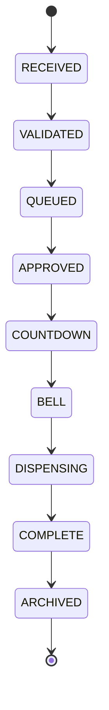

# Alpacaly Event Engine Server

This directory contains the Phase 7F-2A backend and simulated Barn edge-controller foundation for Alpacaly Ever After. It is a Node.js 24 and Express service in which verified Contributions create durable FeedIntents before feed requests can enter the Event Engine. PostgreSQL is the required central production source of truth; SQLite remains the zero-setup development/test store and the independent Barn edge-controller journal. The Event Engine applies welfare and operator-safety rules, runs resource-isolated feeder queues, and requests durable simulated device actions through a configuration-selected hardware-neutral transport.

## Phase 7F-2A boundaries

Included:

- Express HTTP server
- Health endpoint
- Feed-request API
- Browser API client integration with configurable CORS
- SQLite Event Store and restart-safe FIFO queue
- Explicit Barn, Feeder, Camera, Device, and resource Queue identities
- Stable default Barn, Feeder, and Queue assignments for the existing website
- Versioned, in-place SQLite schema migrations
- Independent FIFO processing for every configured feeder
- One simultaneous active lifecycle per feeder
- Feeder queue statistics and resource-aware API routes
- Provider-neutral ProviderEvent ingestion and Contribution verification boundaries
- Provider-scoped idempotency using `provider` and `externalEventId`
- Immutable ProviderEvent, Contribution, and Event links
- Structured persistent contribution audit records
- One immutable FeedIntent and one durable Outbox entry per eligible Contribution
- Automatic Outbox reconciliation, retry, clean shutdown, and restart recovery
- Database-enforced one-to-one FeedIntent-to-Event processing
- Durable `RING_BELL` and `DISPENSE_FEED` DeviceCommands with one command per Event action
- Persistent Device Command Outbox, state history, acknowledgements, and audit records
- Hardware-neutral `DeviceTransport` contract with an in-process transport
- Configuration-selected MQTT transport with an MQTT 5 production profile
- Versioned controller/Barn/Feeder topic namespace and strict topic identity checks
- Canonically serialized Ed25519 command, acknowledgement, heartbeat, status,
  assignment, and safety envelopes with rotation/revocation support
- Retained, signed, expiring and fenced assignment/emergency-stop state
- Durable assignment generations, authority leases, delivery/replay evidence,
  protocol events, controller boot identity, and reconnect reconciliation
- Embedded loopback broker tests requiring no manual broker installation
- Separately runnable Barn edge-controller process with its own SQLite journal
- Hardware abstraction and deterministic PLC/microcontroller safety simulation
- One-use cycle tokens, watchdog, hard output bounds, and outputs-OFF defaults
- Event-scoped bell/dispense reservations with versioned sensor evidence
- Durable welfare/calibration gates, maintenance mode, and restart recovery
- Protected, signed, secret-free edge-controller administrator visibility
- Persistent simulated controller identities and Barn/Feeder assignments
- Durable controller execution journals and restart-safe action memory
- `ACCEPTED`, `STARTED`, and `SUCCEEDED` acknowledgement progression
- Deterministic success, delay, loss, rejection, failure, disconnect, restart,
  heartbeat-loss, malformed-message, and wrong-resource simulation modes
- Protected controller status, execution, configuration, connection, and restart APIs
- Acknowledgement-gated `BELL` and `DISPENSING` lifecycle advancement
- Per-feeder command ordering, idempotent command IDs, monotonic fencing tokens, retry, timeout, and unknown-outcome handling
- Restart-safe simulated device execution memory that prevents duplicate physical simulation
- Development-only simulated WEBSITE Contribution flow
- Immutable, server-generated Event IDs
- Timestamped lifecycle timeline for every accepted request
- Strict lifecycle transitions from `RECEIVED` through `ARCHIVED`
- Automatic database reconnection, state restoration, and lifecycle resumption
- Live browser updates over Server-Sent Events
- Server-calculated queue positions and estimated wait times
- Supporter display of the live Event ID, lifecycle state, queue position, and wait estimate
- Admin display of the live queue, active event, archive, and server connection status
- Provider-neutral `AuthProvider` boundary for a future managed OpenID Connect provider
- Development-only, server-controlled administrator identities
- Persisted Administrators, RoleAssignments, BarnScopes, and append-only OperatorAuditRecords
- `VIEWER`, `WELFARE_OPERATOR`, `HARDWARE_OPERATOR`, and `ADMINISTRATOR` permissions
- Barn-scoped authorization with explicit platform-wide assignments
- Protected administrator, queue-history, device-command, welfare, and reset APIs
- Durable feeder pause/unavailable/maintenance and device pause/maintenance state
- Durable platform, Barn, and Feeder emergency stops with hierarchical command gating
- Restart-latched emergency stops and explicit safe supporter availability
- Two-person emergency clearance with welfare/hardware authority separation
- Two-platform-Administrator clearance for platform emergency stops
- Fifteen-minute, append-only critical approval requests and decisions
- Durable `OUTCOME_UNKNOWN` resolution cases that block only the affected feeder
- Conservative uncertain-dispense welfare accounting
- Dual-approved confirmed outcomes and welfare cancellation
- Separately approved replacement dispense commands with new command IDs, links to the original command, and fresh welfare validation
- Provider-neutral critical-authentication checks that require managed, strong authentication in production
- Simple administrator safety panels for stops, approvals, and resolution cases
- Public API presenters that omit supporter identity, Contribution data, lifecycle internals, and hardware details
- REST polling fallback and automatic recovery after temporary server outages
- Future-facing bell and dispensing acknowledgement records
- Restart-safe duplicate protection across ProviderEvents, Contributions, FeedIntents, Outbox entries, and Events
- Configurable daily feed limit and feeding window
- Structured JSON application and HTTP request logs
- Automated unit and API tests
- Automated SQLite schema and restart-recovery tests
- PostgreSQL central persistence with transactional, checksummed migrations
- Durable multi-worker identities, claims, leases, heartbeats, fencing, bounded
  retries, dead-letter state, and operator-review state
- Real PostgreSQL and two-process contention tests in CI
- Offline SQLite-to-PostgreSQL migration and reconciliation tooling

Intentionally excluded:

- Stripe or any real payment processing
- YouTube, TikTok, Facebook, or other provider integrations
- Real managed OpenID Connect provider integration, passwords, and production sessions
- Real feeder control, GPIO, Raspberry Pi, or ESP32 integration
- Production broker hosting, certificates, certificate authority, or device enrolment
- Camera integration or streaming
- Live-video integration

PostgreSQL is the central production source of truth; SQLite provides the same central contract for local development and tests. ProviderEvent ingestion, Contribution verification, FeedIntent authorisation, Feed Request creation, lifecycle coordination, Device Command creation, delivery, and acknowledgement handling remain separate responsibilities. Durable claims and database constraints make crash recovery and cross-process ownership explicit. The detailed production contract, configuration, migration procedure, diagnostics, testing, contention baseline, and rollout guidance are in [`docs/postgresql-persistence.md`](docs/postgresql-persistence.md).

## Requirements

- Node.js 24 LTS
- npm 11 or later

## Local setup

```sh
cd server
cp .env.example .env
npm install
npm run dev
```

The default server address is `http://localhost:3000`.

## Configuration

| Variable | Default | Purpose |
| --- | --- | --- |
| `NODE_ENV` | `development` | Runtime environment label used in logs and health output. |
| `PORT` | `3000` | HTTP listening port. |
| `LOG_LEVEL` | `info` | Pino structured-log level. |
| `MAX_DAILY_FEEDS` | `100` | Maximum feed requests accepted per feeder in one local calendar day. |
| `ENFORCE_FEEDING_WINDOW` | `false` | Reject requests outside the configured welfare window when `true`. |
| `FEEDING_WINDOW_START` | `08:00` | Local start time in 24-hour format. |
| `FEEDING_WINDOW_END` | `18:00` | Local end time in 24-hour format. |
| `REQUEST_BODY_LIMIT` | `16kb` | Maximum JSON request-body size accepted by Express. |
| `CORS_ORIGIN` | `*` | Browser origin allowed to call the API. Restrict this before production. |
| `CENTRAL_DATABASE_TYPE` | `sqlite` | Selects `sqlite` outside production or `postgres`; production requires PostgreSQL. |
| `DATABASE_PATH` | `./data/alpacaly.sqlite` | SQLite Event Store path, resolved from the server working directory. |
| `DATABASE_URL` | unset | PostgreSQL connection secret. Required for the PostgreSQL central store and never logged. |
| `POSTGRES_SSL_MODE` | `disable` outside production | `disable`, `require`, or `verify-full`; production requires `verify-full`. |
| `POSTGRES_POOL_MINIMUM`, `POSTGRES_POOL_MAXIMUM` | `0`, `10` | Per-process central database connection bounds. |
| `POSTGRES_CONNECTION_TIMEOUT_MS` | `5000` | Maximum connection establishment wait. |
| `POSTGRES_STATEMENT_TIMEOUT_MS`, `POSTGRES_LOCK_TIMEOUT_MS` | `15000`, `5000` | Database statement and lock wait bounds. |
| `POSTGRES_IDLE_TRANSACTION_TIMEOUT_MS` | `15000` | Fails abandoned database transactions closed. |
| `WORKER_LEASE_DURATION_MS`, `WORKER_HEARTBEAT_INTERVAL_MS` | `30000`, `5000` | Distributed ownership lease and renewal cadence. |
| `WORKER_MAXIMUM_CLAIM_DURATION_MS` | `300000` | Hard non-extendable ownership duration. |
| `WORKER_MAXIMUM_ATTEMPTS` | `10` | Bound before safe work enters dead-letter state. |
| `ENABLE_DEMO_RESET` | development only | Enables the Reset Demo button and reset endpoint outside production. |
| `ENABLE_DEVELOPMENT_CONTRIBUTION_SIMULATION` | development only | Enables simulated WEBSITE Contributions and legacy write adapters. Always disabled when `NODE_ENV=production`. |
| `ENABLE_DEVELOPMENT_AUTHENTICATION` | `false` | Explicitly enables server-controlled local administrator identities in development or test. It is always rejected in production. The example development environment enables it. |
| `MANAGED_IDENTITY_PROVIDER_CONFIGURED` | `false` | Confirms that production critical actions are backed by a managed identity provider. Development identities never satisfy this production safeguard. |
| `CRITICAL_APPROVAL_LIFETIME_MS` | `900000` | Maximum lifetime of a dual-approval request. It is bounded to 1–60 minutes and defaults to 15 minutes. |
| `OUTBOX_POLL_INTERVAL_MS` | `250` | Delay between background checks for durable FeedIntent work. |
| `OUTBOX_RETRY_DELAY_MS` | `1000` | Delay before retrying a failed Outbox processing attempt. |
| `DEVICE_COMMAND_POLL_INTERVAL_MS` | `100` | Delay between durable Device Command reconciliation passes. |
| `DEVICE_COMMAND_RETRY_DELAY_MS` | `1000` | Delay before retrying a command confirmed not to have run. |
| `DEVICE_COMMAND_MAXIMUM_ATTEMPTS` | `3` | Maximum safe delivery attempts before a command fails. |
| `DEVICE_ACKNOWLEDGEMENT_TIMEOUT_MS` | `5000` | Deadline for a device acknowledgement before reconciliation. |
| `DEVICE_TRANSPORT` | `in_process` | Selects `in_process` or `mqtt`; production never falls back automatically. |
| `MQTT_ENVIRONMENT` | runtime environment | Environment-isolated topic namespace. |
| `MQTT_PROTOCOL_VERSION` | `5` | MQTT wire version. Production requires 5. |
| `MQTT_BROKER_URL` | unset | Broker URL. Required for MQTT; production requires `mqtts://`. |
| `MQTT_COMMAND_EXPIRY_MS` | `15000` | Signed command lifetime. |
| `MQTT_AUTHORITY_LEASE_MS` | `30000` | Maximum time a controller may start newly received work under current authority. |
| `MQTT_HEARTBEAT_INTERVAL_MS` | `5000` | Signed controller heartbeat interval. |
| `MQTT_STALE_THRESHOLD_MS` | `15000` | Heartbeat age at which a controller becomes `STALE`. |
| `MQTT_OFFLINE_THRESHOLD_MS` | `30000` | Heartbeat age at which a controller becomes `OFFLINE`. |
| `MQTT_DEVELOPMENT_KEYS` | development only | Enables committed test fixtures outside production. Production rejects them. |
| `SIMULATED_CONTROLLER_HEARTBEAT_INTERVAL_MS` | `5000` | Interval between in-process controller heartbeats. |
| `SIMULATED_CONTROLLER_HEARTBEAT_TIMEOUT_MS` | `15000` | Age after which the backend reports an online controller as `STALE`. |
| `ENABLE_SIMULATED_CONTROLLER_CONFIGURATION` | development only | Enables protected behaviour, connection, and restart controls. Always disabled when `NODE_ENV=production`. |
| `EDGE_CALIBRATION_VERSION` | `simulated-calibration-v1` | Calibration version placed in new backend Device Commands. |
| `EDGE_WELFARE_CONFIGURATION_VERSION` | `edge-welfare-v1` | Welfare version placed in new backend Device Commands. |
| `EDGE_DATABASE_PATH` | `./data/barn-edge.sqlite` | Independent local journal for the separately runnable edge process. |
| `EDGE_CONTROLLER_ID`, `EDGE_BARN_ID`, `EDGE_FEEDER_IDS` | default resources | Fixed identities assigned to the edge process. |
| `EDGE_BARN_TIMEZONE` | `Europe/London` | IANA timezone used for local permitted feeding windows. |
| `EDGE_BOOTSTRAP_SIMULATED_FIXTURES` | `false` | Explicitly installs short-lived simulator-only welfare/calibration fixtures in non-production modes. |
| `EDGE_BELL_DURATION_MS`, `EDGE_COUNTDOWN_DURATION_MS` | `3000`, `10000` | Local edge bell and countdown timing; neither grants motor authority. |
| `EDGE_WATCHDOG_PULSE_MS` | `100` | Required safety-controller watchdog pulse interval. |
| `EDGE_BELL_FAILURE_POLICY` | `CANCEL` | Safer default cancels before STARTED if the bell fails. |
| `LIFECYCLE_COUNTDOWN_MS` | `10000` | Simulated countdown duration before the bell stage. |
| `LIFECYCLE_BELL_MS` | `3000` | Simulated bell-stage duration. No bell hardware is controlled. |
| `LIFECYCLE_DISPENSING_MS` | `2000` | Simulated dispensing-stage duration. No feeder hardware is controlled. |
| `LIFECYCLE_ARCHIVE_DELAY_MS` | `2000` | Delay between completion and persistent archival. |

## Persistent Event Store

The central Event Store uses PostgreSQL in production and `node:sqlite` for zero-setup development/testing. File-backed SQLite databases retain foreign keys, write-ahead logging, full synchronous durability, and a five-second busy timeout. The independent edge journal remains SQLite in every environment.

The schema is upgraded automatically through ordered migrations when the server connects. SQLite migration 11 adds daily feed reservations and distributed worker coordination. PostgreSQL migrations create the equivalent central schema, native timestamp/JSON types, database Event sequence, ownership records, foreign keys, relationship guards, and append-only triggers under a cross-instance advisory lock. The independent edge journal has its own schema version 1 and database file. Existing SQLite central data can be transferred with the documented offline migration tool.

## Simulated controller and MQTT architecture

The Device Command worker depends only on `DeviceTransport`. Phase 7E-2 keeps the
`InProcessDeviceTransport` and adds `MqttDeviceTransport` behind configuration.
The MQTT adapter handles connection/reconnect, signed publishing, inbound
acknowledgements/heartbeats/status, retained assignments/safety state,
observability, reconciliation, and graceful shutdown without changing the Event
Engine or Device Command state machine.

The controller validates its identity, Barn, Feeder, Device, fencing token,
operational state, and current Phase 7B-2 safety state before acting. It records
`RECEIVED -> ACCEPTED -> STARTED -> COMPLETED` in its durable journal and emits
the equivalent Device Acknowledgements through the normal server acknowledgement
service. Repeated delivery returns the persisted result, repeated acknowledgements
are deduplicated, and `SimulatedDeviceExecutions` remains the exactly-once physical
action guard.

If a restart or failure occurs before the action, delivery may safely resume. If
the journal proves a dispense occurred but cannot prove the final result,
reconciliation returns `OUTCOME_UNKNOWN`; the existing operator-resolution and
welfare-blocking workflow remains authoritative and no automatic retry occurs.
Emergency stops, disabled Feeders or Devices, disabled/offline/stale controllers,
and unresolved outcome cases all prevent new simulated actions.

Controller administration is protected below `/api/admin`. Disable is immediate;
production enable/re-enable and reassignment use expiring two-person approval.
Protocol views expose boot, heartbeat, assignment generation, lease, sanitized
errors, counters, and reconciliation state without secrets.

The detailed architecture, topic/envelope contracts, signing and test credential
handling, X.509 expectations, ACL model, retention, fencing, leases, emergency
stops, journal/reconciliation rules, configuration, broker limitations, and
remaining simulations are documented in
[`docs/secure-mqtt-transport.md`](docs/secure-mqtt-transport.md).

The independent journal, hardware abstraction, safety-controller handshake,
feed-cycle reservation, evidence rules, welfare/calibration gates, maintenance,
recovery, configuration safeguards, simulator controls, administrator view, and
future adapter boundary are documented in
[`docs/barn-edge-controller.md`](docs/barn-edge-controller.md).

## Operator safety flow

Emergency-stop activation is immediate. A platform stop blocks every feeder, a Barn stop blocks that Barn, and a Feeder stop blocks only its feeder. Commands proven not to have started are cancelled. Sent or timed-out commands whose physical result cannot be proven become `OUTCOME_UNKNOWN`; dispense commands then create one durable resolution case, count the uncertain quantity conservatively, and block that feeder without automatic retry.

Clearing a Feeder or Barn stop requires two distinct people who collectively hold current welfare and hardware authority. Clearing a platform stop requires two distinct platform Administrators. The requester cannot approve, decisions expire after 15 minutes, and current account status, role, Barn scope, and authentication strength are checked again at decision and execution time.

An uncertain dispense may be resolved as `CONFIRMED_DISPENSED`, `CONFIRMED_NOT_DISPENSED`, `CANCELLED_FOR_WELFARE`, or `MANUAL_REVIEW_REQUIRED`. The first three require the same two-authority approval. Manual review keeps the case and feeder blocked. A confirmed-not-dispensed case does not retry automatically; a replacement requires a second dual-approval request, current welfare validation, and a new immutable command linked to both the original command and resolution case.

```sql
CREATE TABLE Events (
    eventId TEXT PRIMARY KEY,
    type TEXT NOT NULL,
    sequenceNumber INTEGER NOT NULL UNIQUE,
    supporterName TEXT NOT NULL,
    source TEXT NOT NULL,
    message TEXT NOT NULL DEFAULT '',
    clientRequestId TEXT UNIQUE,
    requestedAt TEXT NOT NULL,
    updatedAt TEXT NOT NULL,
    currentState TEXT NOT NULL,
    barnId TEXT,
    feederId TEXT,
    queueId TEXT,
    contributionId TEXT,
    feedIntentId TEXT,
    FOREIGN KEY (barnId) REFERENCES Barns(barnId),
    FOREIGN KEY (feederId) REFERENCES Feeders(feederId),
    FOREIGN KEY (queueId) REFERENCES Queues(queueId),
    FOREIGN KEY (contributionId) REFERENCES Contributions(contributionId),
    FOREIGN KEY (feedIntentId) REFERENCES FeedIntents(feedIntentId)
) STRICT;

CREATE TABLE ProviderEvents (
    providerEventId TEXT PRIMARY KEY,
    provider TEXT NOT NULL,
    externalEventId TEXT NOT NULL,
    receivedAt TEXT NOT NULL,
    verificationStatus TEXT NOT NULL,
    rawMetadataJson TEXT NOT NULL DEFAULT 'null',
    rejectionReason TEXT,
    createdAt TEXT NOT NULL,
    updatedAt TEXT NOT NULL,
    UNIQUE (provider, externalEventId)
) STRICT;

CREATE TABLE Contributions (
    contributionId TEXT PRIMARY KEY,
    providerEventId TEXT NOT NULL UNIQUE,
    verifiedAt TEXT NOT NULL,
    amountMinor INTEGER NOT NULL,
    currency TEXT NOT NULL,
    supporterDisplayName TEXT NOT NULL,
    eligibilityStatus TEXT NOT NULL,
    feedQuantity INTEGER NOT NULL,
    metadataJson TEXT NOT NULL DEFAULT 'null',
    createdAt TEXT NOT NULL,
    updatedAt TEXT NOT NULL,
    FOREIGN KEY (providerEventId) REFERENCES ProviderEvents(providerEventId)
) STRICT;

CREATE TABLE AuditRecords (
    auditSequence INTEGER PRIMARY KEY AUTOINCREMENT,
    auditRecordId TEXT NOT NULL UNIQUE,
    action TEXT NOT NULL,
    providerEventId TEXT,
    contributionId TEXT,
    eventId TEXT,
    occurredAt TEXT NOT NULL,
    detailsJson TEXT NOT NULL DEFAULT 'null'
) STRICT;

CREATE TABLE FeedIntents (
    feedIntentId TEXT PRIMARY KEY,
    contributionId TEXT NOT NULL UNIQUE,
    barnId TEXT NOT NULL,
    feederId TEXT NOT NULL,
    queueId TEXT NOT NULL,
    message TEXT NOT NULL DEFAULT '',
    status TEXT NOT NULL,
    createdAt TEXT NOT NULL,
    outboxQueuedAt TEXT NOT NULL,
    processingStartedAt TEXT,
    feedRequestCreatedAt TEXT,
    queueInsertionCompletedAt TEXT,
    processingCompletedAt TEXT,
    processingFailedAt TEXT,
    failureReason TEXT,
    attemptCount INTEGER NOT NULL,
    updatedAt TEXT NOT NULL,
    FOREIGN KEY (contributionId) REFERENCES Contributions(contributionId)
) STRICT;

CREATE TABLE Outbox (
    outboxSequence INTEGER PRIMARY KEY AUTOINCREMENT,
    outboxEntryId TEXT NOT NULL UNIQUE,
    feedIntentId TEXT NOT NULL UNIQUE,
    status TEXT NOT NULL,
    createdAt TEXT NOT NULL,
    availableAt TEXT NOT NULL,
    processingStartedAt TEXT,
    completedAt TEXT,
    failedAt TEXT,
    attemptCount INTEGER NOT NULL,
    lastError TEXT,
    updatedAt TEXT NOT NULL,
    FOREIGN KEY (feedIntentId) REFERENCES FeedIntents(feedIntentId)
) STRICT;

CREATE TABLE FeedIntentHistory (
    historySequence INTEGER PRIMARY KEY AUTOINCREMENT,
    feedIntentId TEXT NOT NULL,
    action TEXT NOT NULL,
    timestamp TEXT NOT NULL,
    detailsJson TEXT NOT NULL DEFAULT 'null',
    FOREIGN KEY (feedIntentId) REFERENCES FeedIntents(feedIntentId)
) STRICT;

CREATE TABLE Barns (
    barnId TEXT PRIMARY KEY,
    name TEXT NOT NULL,
    timezone TEXT NOT NULL,
    createdAt TEXT NOT NULL
) STRICT;

CREATE TABLE Feeders (
    feederId TEXT PRIMARY KEY,
    barnId TEXT NOT NULL,
    name TEXT NOT NULL,
    createdAt TEXT NOT NULL,
    FOREIGN KEY (barnId) REFERENCES Barns(barnId)
) STRICT;

CREATE TABLE Cameras (
    cameraId TEXT PRIMARY KEY,
    barnId TEXT NOT NULL,
    name TEXT NOT NULL,
    createdAt TEXT NOT NULL,
    FOREIGN KEY (barnId) REFERENCES Barns(barnId)
) STRICT;

CREATE TABLE Devices (
    deviceId TEXT PRIMARY KEY,
    barnId TEXT NOT NULL,
    name TEXT NOT NULL,
    kind TEXT NOT NULL,
    createdAt TEXT NOT NULL,
    FOREIGN KEY (barnId) REFERENCES Barns(barnId)
) STRICT;

CREATE TABLE Queues (
    queueId TEXT PRIMARY KEY,
    barnId TEXT NOT NULL,
    feederId TEXT NOT NULL UNIQUE,
    resourceType TEXT NOT NULL,
    resourceId TEXT NOT NULL,
    name TEXT NOT NULL,
    createdAt TEXT NOT NULL,
    FOREIGN KEY (barnId) REFERENCES Barns(barnId),
    FOREIGN KEY (feederId, barnId) REFERENCES Feeders(feederId, barnId)
) STRICT;

CREATE TABLE LifecycleHistory (
    historyId INTEGER PRIMARY KEY AUTOINCREMENT,
    eventId TEXT NOT NULL,
    ordinal INTEGER NOT NULL,
    state TEXT NOT NULL,
    timestamp TEXT NOT NULL,
    detailsJson TEXT NOT NULL DEFAULT 'null',
    FOREIGN KEY (eventId) REFERENCES Events(eventId) ON DELETE CASCADE,
    UNIQUE (eventId, ordinal),
    UNIQUE (eventId, state)
) STRICT;

CREATE TABLE Queue (
    eventId TEXT PRIMARY KEY,
    queueId TEXT NOT NULL,
    queuePosition INTEGER NOT NULL,
    enqueuedAt TEXT NOT NULL,
    FOREIGN KEY (eventId) REFERENCES Events(eventId) ON DELETE CASCADE,
    FOREIGN KEY (queueId) REFERENCES Queues(queueId),
    UNIQUE (queueId, queuePosition)
) STRICT;

CREATE TABLE HardwareAcknowledgements (
    acknowledgementId INTEGER PRIMARY KEY AUTOINCREMENT,
    eventId TEXT NOT NULL,
    stage TEXT NOT NULL,
    status TEXT NOT NULL,
    receivedAt TEXT NOT NULL,
    detailsJson TEXT NOT NULL DEFAULT 'null',
    FOREIGN KEY (eventId) REFERENCES Events(eventId) ON DELETE CASCADE
) STRICT;
```

`Queues` describes operational queues, while `Queue` contains their event membership. Database constraints and triggers enforce Barn–Feeder–Queue consistency, one Contribution per ProviderEvent, one FeedIntent per Contribution, one Outbox entry and Event per FeedIntent, verified eligibility before FeedIntent processing, integer minor currency amounts, and immutable identities. An Event insert is rejected unless its matching FeedIntent and Outbox entry are both claimed for processing.

Verifying an eligible Contribution is one transaction containing the Contribution, FeedIntent, Outbox entry, and initial intent history. Processing it is one transaction containing the Event, its Contribution and FeedIntent references, `RECEIVED`, `VALIDATED`, and `QUEUED` history entries, FIFO queue record, `FEED_REQUEST_CREATED` audit record, and completed Outbox state. Each later lifecycle transition is another guarded transaction.

On restart, an Event already in `COUNTDOWN`, `BELL`, `DISPENSING`, or `COMPLETE` resumes at that state. Countdown and archive timing use persisted timestamps. `BELL` and `DISPENSING` reconcile or resume their durable DeviceCommands and advance only after a successful acknowledgement.

The durable creation pipeline is:

```text
ProviderEvent -> Contribution -> FeedIntent -> Outbox -> Feed Request -> Queue
Queue -> BELL -> RING_BELL command -> acknowledgement
      -> DISPENSING -> DISPENSE_FEED command -> acknowledgement -> COMPLETE
```

The Outbox worker starts with the application, repairs any verified eligible Contribution missing durable work, resets interrupted `PROCESSING` entries to `PENDING`, and processes them in Outbox sequence order. It stops accepting background work before the Event Engine closes during server shutdown.

## Feed lifecycle

Every accepted request receives one immutable Event ID and advances through the following states in order:



Every transition adds a timestamped timeline entry and a state-specific timestamp. Only the head of the FIFO queue can be processed. Processing and transition guards prevent the same Event ID from being advanced twice.

Entering `BELL` creates exactly one `RING_BELL` command. Entering `DISPENSING` creates exactly one `DISPENSE_FEED` command. Commands pass through `PENDING`, `READY`, `SENT`, and `ACKNOWLEDGED`, with `RETRY_SCHEDULED`, `TIMED_OUT`, `FAILED`, `OUTCOME_UNKNOWN`, and `CANCELLED` available for non-happy paths. The simulated adapter emits durable acknowledgements; no real device is connected or controlled.

## API

### Health

```http
GET /health
```

Returns HTTP 200 with the service name, environment, timestamp, and process uptime.

### Simulate a website Contribution

```http
POST /api/development/website-contributions
Content-Type: application/json

{
  "supporterName": "Ada",
  "message": "For the herd",
  "clientRequestId": "website-unique-request-123",
  "amountMinor": 500,
  "currency": "GBP"
}
```

This development-only endpoint creates a `WEBSITE` ProviderEvent, applies server-controlled simulated verification, atomically persists its Contribution, FeedIntent, and Outbox entry, and synchronously asks the worker to process the durable work. `amountMinor` is always stored as an integer. Supplying the same `clientRequestId` again returns the original Event rather than creating duplicates. The public response contains only the supporter-safe Event status; ProviderEvent, Contribution, raw metadata, supporter identity, and hardware details remain server-side. The endpoint rejects client-supplied provider, verification, eligibility, contribution, or feed-quantity decisions and is unconditionally disabled in production.

### Legacy development write adapter

```http
POST /api/feed-requests
Content-Type: application/json

{
  "supporterName": "Ada",
  "source": "website",
  "message": "For the herd",
  "clientRequestId": "website-unique-request-123"
}
```

This route remains temporarily for compatibility, but no longer creates an Event directly. In development it delegates to the same simulated WEBSITE Contribution service. It is disabled in production and should not be used by new clients.

### Read the waiting queue

```http
GET /api/feed-requests
```

Returns supporter-safe summaries for the active persistent FIFO queue and archive. Each summary includes its Event ID, current state, queue position, and estimated wait time. Supporter names, messages, client request IDs, Contribution links, complete timelines, and hardware acknowledgement details are omitted.

### Read one feed request

```http
GET /api/feed-requests/:feedRequestId
```

Returns the current supporter-safe state, queue position, and estimated wait time of an accepted request, or HTTP 404 for an unknown ID. Complete timelines and private supporter information are available only through a scoped administrator API. Server restarts do not invalidate Event IDs.

### Legacy feeder development write adapter

```http
POST /api/feeders/:feederId/feed-requests
Content-Type: application/json
```

In development this creates a simulated WEBSITE Contribution and routes its resulting feed request to `feederId`. It is disabled in production. Provider idempotency remains global to the ledger and feeder selection cannot bypass a duplicate provider event.

### Read a feeder queue

```http
GET /api/feeders/:feederId/queue
GET /api/feeders/:feederId/feed-requests
```

Both forms return supporter-safe entries for that feeder's isolated waiting/active queue, archive, and statistics. Statistics include waiting count, active count, archived count, estimated wait, feeder status, and safe active Event status.

### Read one feeder event

```http
GET /api/feeders/:feederId/feed-requests/:feedRequestId
```

Returns the event only when it belongs to the requested feeder.

### Monitor all feeder queues

```http
GET /api/feeders
GET /api/event-engine/queues
```

Returns the statistics for every configured feeder without combining queue contents or ordering.

### Event Engine status

```http
GET /api/event-engine/status
```

Returns the default feeder's queue totals, current lifecycle state, active event summary, accepted/completed counts, archive total, remaining daily allowance, and whether the feeding window is enforced.

### Live lifecycle events

```http
GET /api/event-engine/events
Accept: text/event-stream
```

Opens a Server-Sent Events stream. The server sends a named `lifecycle` event immediately and after every state change. Each event contains the latest Event Engine snapshot; state-change events also identify the Event ID, new state, transition timestamp, and supporter-safe request summary. The admin dashboard uses this stream for real-time state display and keeps REST polling as a fallback.

### Reset the development queue

```http
POST /api/event-engine/reset
Content-Type: application/json
Authorization: Development local-admin

{"reason":"Local development reset"}
```

Clears Event, ledger, Outbox, command, and simulated-device state so the existing Reset Demo button remains functional during local development. Administrator identities and immutable operator audit records are retained. The endpoint requires a platform-wide `ADMINISTRATOR`, records the attempt and result, and is disabled when `ENABLE_DEMO_RESET=false`. Development authentication and reset are unavailable in production.

### Administrator authentication

Every `/api/admin` route requires an authenticated, active Administrator. Phase 7B-1 does not store passwords and does not connect a real identity provider. When `ENABLE_DEVELOPMENT_AUTHENTICATION=true` outside production, local clients may use one of the fixed server-controlled development credentials:

```http
Authorization: Development local-admin
```

The predefined local identities are `local-admin`, `local-viewer`, `local-welfare`, and `local-hardware`. A caller cannot supply roles or Barn scopes; the server maps each credential to persisted assignments. Production rejects this adapter even if the environment variable is set. The authentication service returns an internal trusted identity containing the mapped Administrator ID, external identity ID, active roles and Barn scopes, authentication time and strength, and a session identifier. Session identifiers and credentials are never returned in audit records.

| Role | Barn-scoped capabilities |
| --- | --- |
| `VIEWER` | Barn/feeder status, queues, command history, and scoped audit history |
| `WELFARE_OPERATOR` | Viewer capabilities plus feeding pause, welfare unavailability, welfare notes, and uncertain-outcome review requests |
| `HARDWARE_OPERATOR` | Viewer capabilities plus device pause/maintenance, command failure inspection, policy-permitted retry requests, and hardware-alert acknowledgement |
| `ADMINISTRATOR` | All capabilities plus platform-wide identity, role, Barn-scope, and security-configuration management when explicitly assigned platform-wide |

Principal administrator routes include:

- `GET /api/admin/session`
- `GET /api/admin/barns/:barnId/status`
- `GET /api/admin/barns/:barnId/queues`
- `GET /api/admin/barns/:barnId/feeders/:feederId/feed-requests`
- `GET /api/admin/barns/:barnId/device-commands`
- `GET /api/admin/barns/:barnId/audit-records`
- feeder pause, resume, welfare-unavailable, maintenance, and welfare-note actions under `/api/admin/barns/:barnId`
- device pause, resume, and maintenance actions under `/api/admin/barns/:barnId/devices`
- safe retry and review requests under `/api/admin/barns/:barnId/device-commands`
- Administrator, RoleAssignment, and BarnScope management under `/api/admin/administrators`

Every protected request verifies the active Administrator, required role, Barn scope, and feeder/device membership. Identity-management operations require an explicit platform-wide assignment. Sensitive successful and rejected actions append an `OperatorAuditRecord`; normal services cannot update or delete those records.

Every response includes an `x-request-id` header. API errors use a consistent JSON shape containing `code`, `message`, and `requestId`.

## Structured logging

The server writes newline-delimited JSON logs to standard output. Request-completion entries include the request ID, HTTP method, path, response status, and duration. Feed-request entries include operational IDs and queue position but omit supporter names and messages.

## Tests

```sh
npm test
```

The suite covers all earlier ledger, lifecycle, browser, authorization, safety, migration, and restart behavior. Phase 7D-2 adds deterministic topic/ACL and envelope validation, canonical Ed25519 signing, tampering/revocation/rotation, production fail-closed configuration, live broker connection/reconnect, signed command and acknowledgement flow, duplicate delivery, wrong identity, fencing generations, leases/expiry, retained emergency stops, controller restart, post-dispense `OUTCOME_UNKNOWN`, dual-approved production enablement, immediate disable, protected secret-free protocol visibility, and in-process compatibility.

## Frontend connection

The existing pages use `js/api-client.js` and `js/event-engine.js` to call this service at the URL configured by `CONFIG.apiBaseUrl`. The website submission now calls `/api/development/website-contributions`; no visual or journey changes were made. Feed requests, Event IDs, queue totals, queue positions, wait estimates, lifecycle states, queue entries, archive entries, and development reset all come from the server. The supporter page tracks its resulting Event through targeted REST reads, and both pages receive real-time state changes through the lifecycle event stream with polling as a fallback.

The browser no longer owns or simulates a feed queue or countdown. The public website uses supporter-safe APIs; the admin page loads full queue and archive information only after its configured development identity is accepted. The website's payment display and behaviour remain simulated, and server-side WEBSITE verification is not a real payment check. Countdown, bell, and dispensing remain simulations. Stripe, social/video providers, real hardware, a managed identity provider, production sessions/broker/certificates, supporter identity across page reloads, multi-process worker leasing, and backup automation are not implemented. The public website was not changed in Phase 7D-2.

## Development Summary

Phase 1 established the server boundary, Phases 2–5 made the website lifecycle durable, Phase 6 added resources, queues, Contributions, FeedIntents, and Outbox, Phase 7A added Device Commands, Phase 7B added administrator safety and dual approval, and Phase 7C added the durable simulated controller. Phase 7D-2 now proves the signed MQTT path through an embedded test broker while preserving the in-process transport. Production certificates, broker deployment, physical controllers/hardware, PostgreSQL, multi-instance leasing, and operational backup/recovery remain future work.
