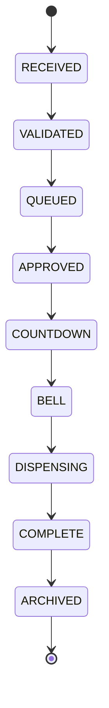

# Alpacaly Event Engine Server

This directory contains the Phase 5 backend for Alpacaly Ever After. It is a Node.js 24 and Express service that accepts feed requests, applies welfare rules through one central server-side Event Engine, persists every lifecycle change in SQLite, runs the lifecycle in strict queue order, broadcasts live state changes, and records request activity as structured JSON logs.

## Phase 5 boundaries

Included:

- Express HTTP server
- Health endpoint
- Feed-request API
- Browser API client integration with configurable CORS
- SQLite Event Store and restart-safe FIFO queue
- Immutable, server-generated Event IDs
- Timestamped lifecycle timeline for every accepted request
- Strict lifecycle transitions from `RECEIVED` through `ARCHIVED`
- Automatic database reconnection, state restoration, and lifecycle resumption
- Live browser updates over Server-Sent Events
- Server-calculated queue positions and estimated wait times
- Supporter display of the live Event ID, lifecycle state, queue position, and wait estimate
- Admin display of the live queue, active event, archive, and server connection status
- REST polling fallback and automatic recovery after temporary server outages
- Future-facing bell and dispensing acknowledgement records
- Duplicate-request protection when a client request ID is supplied
- Configurable daily feed limit and feeding window
- Structured JSON application and HTTP request logs
- Automated unit and API tests
- Automated SQLite schema and restart-recovery tests

Intentionally excluded:

- Stripe or any payment processing
- Authentication and authorisation
- Hardware or feeder control
- YouTube or other live-video integration

SQLite is the durable source of truth. The Event Engine maintains a synchronized in-process view for fast API and live-update responses, rebuilds that view from SQLite at startup, restores the persisted FIFO queue, and resumes the head event from its latest stored state. Event IDs, duplicate client IDs, histories, acknowledgements, queue order, and archives survive server restarts.

## Requirements

- Node.js 24 LTS
- npm 11 or later

## Local setup

```sh
cd server
cp .env.example .env
npm install
npm run dev
```

The default server address is `http://localhost:3000`.

## Configuration

| Variable | Default | Purpose |
| --- | --- | --- |
| `NODE_ENV` | `development` | Runtime environment label used in logs and health output. |
| `PORT` | `3000` | HTTP listening port. |
| `LOG_LEVEL` | `info` | Pino structured-log level. |
| `MAX_DAILY_FEEDS` | `100` | Maximum feed requests accepted in one local calendar day. |
| `ENFORCE_FEEDING_WINDOW` | `false` | Reject requests outside the configured welfare window when `true`. |
| `FEEDING_WINDOW_START` | `08:00` | Local start time in 24-hour format. |
| `FEEDING_WINDOW_END` | `18:00` | Local end time in 24-hour format. |
| `REQUEST_BODY_LIMIT` | `16kb` | Maximum JSON request-body size accepted by Express. |
| `CORS_ORIGIN` | `*` | Browser origin allowed to call the API. Restrict this before production. |
| `DATABASE_PATH` | `./data/alpacaly.sqlite` | SQLite Event Store path, resolved from the server working directory. |
| `ENABLE_DEMO_RESET` | development only | Enables the Reset Demo button and reset endpoint outside production. |
| `LIFECYCLE_COUNTDOWN_MS` | `10000` | Simulated countdown duration before the bell stage. |
| `LIFECYCLE_BELL_MS` | `3000` | Simulated bell-stage duration. No bell hardware is controlled. |
| `LIFECYCLE_DISPENSING_MS` | `2000` | Simulated dispensing-stage duration. No feeder hardware is controlled. |
| `LIFECYCLE_ARCHIVE_DELAY_MS` | `2000` | Delay between completion and persistent archival. |

## Persistent Event Store

The persistent Event Store introduced in Phase 4 uses the `node:sqlite` module included with Node.js 24, so no additional database package or native addon is required. File-backed databases use foreign keys, write-ahead logging, full synchronous durability, and a five-second busy timeout.

The schema is created automatically when the server connects:

```sql
CREATE TABLE Events (
    eventId TEXT PRIMARY KEY,
    type TEXT NOT NULL,
    sequenceNumber INTEGER NOT NULL UNIQUE,
    supporterName TEXT NOT NULL,
    source TEXT NOT NULL,
    message TEXT NOT NULL DEFAULT '',
    clientRequestId TEXT UNIQUE,
    requestedAt TEXT NOT NULL,
    updatedAt TEXT NOT NULL,
    currentState TEXT NOT NULL
) STRICT;

CREATE TABLE LifecycleHistory (
    historyId INTEGER PRIMARY KEY AUTOINCREMENT,
    eventId TEXT NOT NULL,
    ordinal INTEGER NOT NULL,
    state TEXT NOT NULL,
    timestamp TEXT NOT NULL,
    detailsJson TEXT NOT NULL DEFAULT 'null',
    FOREIGN KEY (eventId) REFERENCES Events(eventId) ON DELETE CASCADE,
    UNIQUE (eventId, ordinal),
    UNIQUE (eventId, state)
) STRICT;

CREATE TABLE Queue (
    eventId TEXT PRIMARY KEY,
    queuePosition INTEGER NOT NULL UNIQUE,
    enqueuedAt TEXT NOT NULL,
    FOREIGN KEY (eventId) REFERENCES Events(eventId) ON DELETE CASCADE
) STRICT;

CREATE TABLE HardwareAcknowledgements (
    acknowledgementId INTEGER PRIMARY KEY AUTOINCREMENT,
    eventId TEXT NOT NULL,
    stage TEXT NOT NULL,
    status TEXT NOT NULL,
    receivedAt TEXT NOT NULL,
    detailsJson TEXT NOT NULL DEFAULT 'null',
    FOREIGN KEY (eventId) REFERENCES Events(eventId) ON DELETE CASCADE
) STRICT;
```

State and acknowledgement columns also have database-level `CHECK` constraints, and lookup indexes are created for lifecycle state, history order, queue position, and acknowledgements.

Creating a request is one transaction containing the Event, its `RECEIVED`, `VALIDATED`, and `QUEUED` history entries, and its FIFO queue record. Each later transition is another guarded transaction. A transition can only update the exact state the Event Engine expects, preventing two processors from advancing the same event.

On restart, an event already in `COUNTDOWN`, `BELL`, `DISPENSING`, or `COMPLETE` resumes at that state. The remaining simulated delay is calculated from the persisted state timestamp rather than restarting the full delay.

## Feed lifecycle

Every accepted request receives one immutable Event ID and advances through the following states in order:



Every transition adds a timestamped timeline entry and a state-specific timestamp. Only the head of the FIFO queue can be processed. Processing and transition guards prevent the same Event ID from being advanced twice.

The `BELL` and `DISPENSING` records include hardware-acknowledgement placeholders. The Event Engine persists future acknowledgement records, but Phase 5 does not connect to or control any device.

## API

### Health

```http
GET /health
```

Returns HTTP 200 with the service name, environment, timestamp, and process uptime.

### Submit a feed request

```http
POST /api/feed-requests
Content-Type: application/json

{
  "supporterName": "Ada",
  "source": "website",
  "message": "For the herd",
  "clientRequestId": "website-unique-request-123"
}
```

`supporterName` is required. The other fields are optional. Supplying a stable, unique `clientRequestId` lets the Event Engine reject accidental retries. Accepted requests return HTTP 202 with a permanent server-generated Event ID, current state, queue position, estimated wait time, state timestamps, and timeline.

### Read the waiting queue

```http
GET /api/feed-requests
```

Returns supporter-safe summaries for the active persistent FIFO queue and archive. Each summary includes its current state, queue position, estimated wait time, and timeline. Messages and client request IDs are omitted.

### Read one feed request

```http
GET /api/feed-requests/:feedRequestId
```

Returns the current representation, queue position, estimated wait time, and complete persistent timeline of an accepted request, or HTTP 404 for an unknown ID. Server restarts do not invalidate Event IDs.

### Event Engine status

```http
GET /api/event-engine/status
```

Returns queue totals, the current lifecycle state, the active event summary, the current local date, accepted/completed counts, archive total, remaining daily allowance, and whether the feeding window is enforced.

### Live lifecycle events

```http
GET /api/event-engine/events
Accept: text/event-stream
```

Opens a Server-Sent Events stream. The server sends a named `lifecycle` event immediately and after every state change. Each event contains the latest Event Engine snapshot; state-change events also identify the Event ID, new state, transition timestamp, and supporter-safe request summary. The admin dashboard uses this stream for real-time state display and keeps REST polling as a fallback.

### Reset the development queue

```http
POST /api/event-engine/reset
Content-Type: application/json

{}
```

Clears the persistent Event Store so the existing Reset Demo button remains functional during local development. The endpoint is disabled by default when `NODE_ENV=production` and should never be enabled publicly.

Every response includes an `x-request-id` header. API errors use a consistent JSON shape containing `code`, `message`, and `requestId`.

## Structured logging

The server writes newline-delimited JSON logs to standard output. Request-completion entries include the request ID, HTTP method, path, response status, and duration. Feed-request entries include operational IDs and queue position but omit supporter names and messages.

## Tests

```sh
npm test
```

The test suite covers Event Engine rules, all nine lifecycle transitions, timestamp histories, immutable IDs, FIFO ordering, server-calculated wait estimates, duplicate-processing prevention, future acknowledgement records, the public HTTP contract, the reusable browser API client, graceful backend outages, stale-response protection, and live browser adapter updates. SQLite tests create isolated temporary databases and verify schema creation, restart restoration, persistent duplicate protection, acknowledgements, archives, and mid-countdown recovery.

## Frontend connection

The existing pages use `js/api-client.js` and `js/event-engine.js` to call this service at the URL configured by `CONFIG.apiBaseUrl`. Feed requests, Event IDs, queue totals, queue positions, wait estimates, lifecycle states, queue entries, archive entries, and development reset all come from the server. The supporter page tracks its submitted event through targeted REST reads, and both pages receive real-time state changes through the lifecycle event stream with polling as a fallback. Temporary outages display an unavailable state and recover automatically without changing either page's layout.

The browser no longer owns or simulates a feed queue or countdown. Countdown, bell, dispensing, and archive delays remain server-side simulations. Payments remain an explicitly simulated local-storage feature until a later Stripe phase. Bell/feeder hardware, YouTube, authentication, supporter identity across page reloads, multi-process coordination, database backup automation, and production approval rules are not implemented. Wait times are estimates derived from the configured simulated stage durations.

## Development Summary

Phase 1 established the server boundary, Phase 2 connected the supporter and admin experiences, Phase 3 added the complete lifecycle and live state updates, and Phase 4 made SQLite the durable Event Store. Phase 5 removes the remaining browser-side feed-queue simulation: the supporter now displays its live server Event ID, state, queue position, and wait estimate, while the admin reads the real active queue and archive and reports server availability. SSE drives immediate changes, REST polling provides recovery, and persisted server state keeps the dashboard correct after restarts. Express owns transport, the Event Engine owns lifecycle policy and wait estimates, SQLite owns durable state, and Pino provides machine-readable operational logs. Real payment, identity, YouTube, hardware control, multi-instance processing, and operational backup/recovery remain future work.
